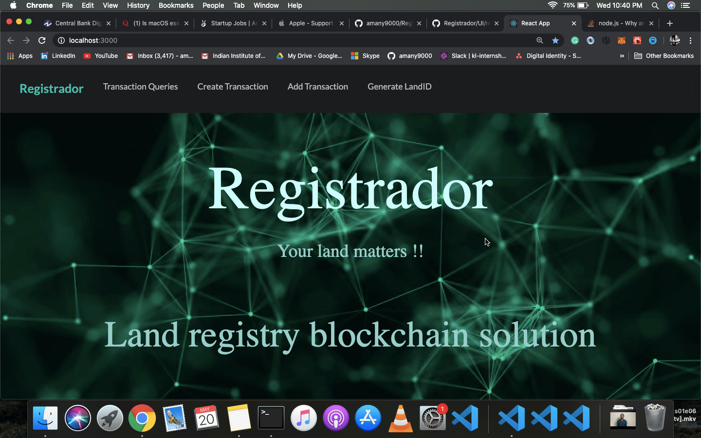
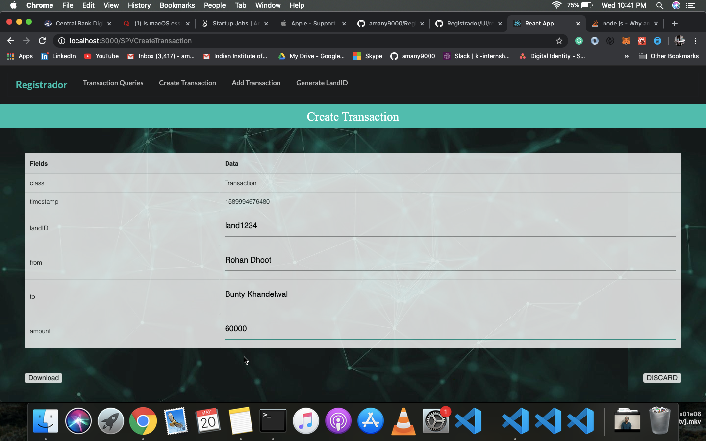
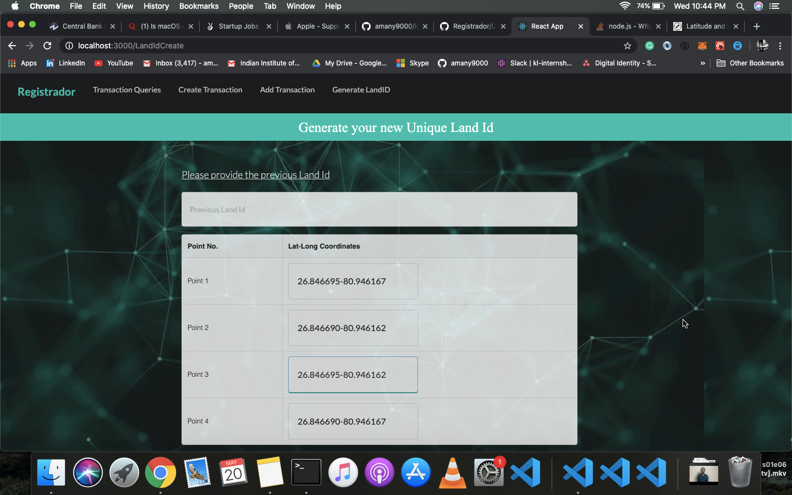

# Registrador
A blockchain based land registry application. 

## About
The Blockchain network is created through the discovery-swarm module. The blockchain is private. Block appending authority is only given to Authorised Nodes aka Government Nodes. 

## Types of Blockchain Nodes - 

### Government Nodes

The Block Makers, which are run/maintained by the government officials. In the Bitcoin Blockchain, they are called “Miners”. As the blockchain is a public ledger, the government officials running the authorised nodes are held accountable.

### The FullNode

Just like the bitcoin blockchain, they are the nodes which store and verify the entire Blockchain but can not append new blocks. They can be run by any individual who wants to keep the corruption of the Government Officials in check.

### SPV/Thin Client

This client is run by a general user wanting to sell/buy land. It is only client-side hence React based.








### Development

-   Install SPV's Dependencies.

```sh
cd UI/reactapp-spv/
npm install
```

-   To run the SPV.

```sh
cd UI/reactapp-spv/
npm start
```
---

### Technologies Used

##### Back End

-   [Node](https://nodejs.org)
-   [MongoDB](https://www.mongodb.com/)


##### Front End

-   [React](https://reactjs.org)

---

### Contributing

See [CONTRIBUTING.md](CONTRIBUTING.md).

---

### Team Members

-   [Aman Singh](https://github.com/aman2210)
-   [Dipansh Khandelwal](https://github.com/DipanshKhandelwal)
-   [Rohan Dhoot](https://github.com/rohan2599)
-   and [Myself](https://github.com/amany9000)

---

Found a bug? Create an [issue](https://github.com/amany9000/Registrador/issues).